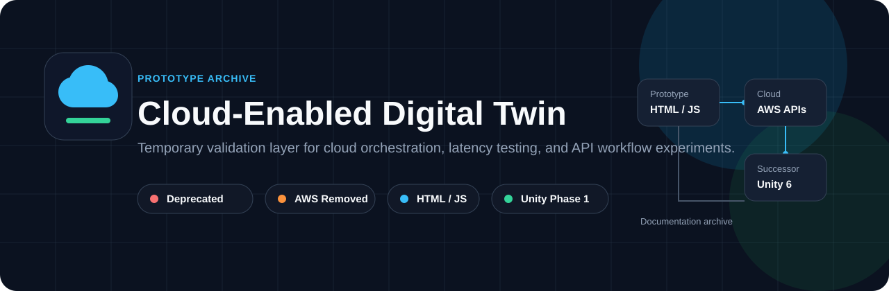
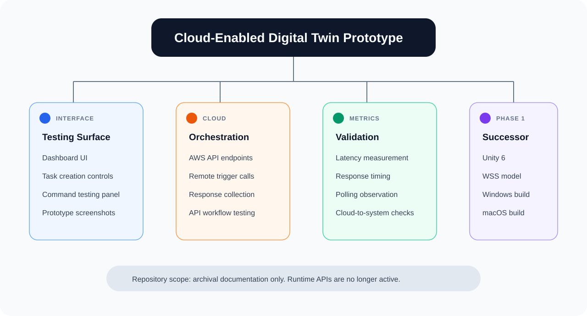
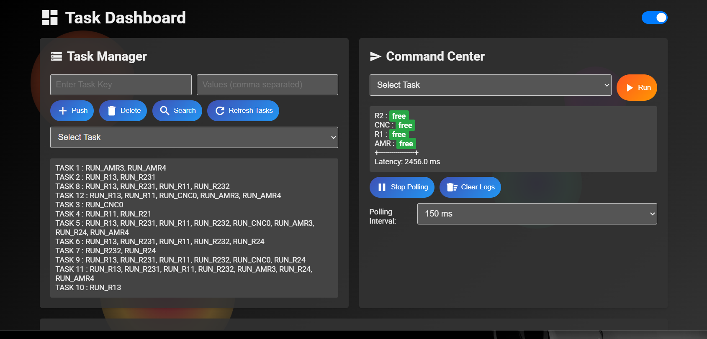
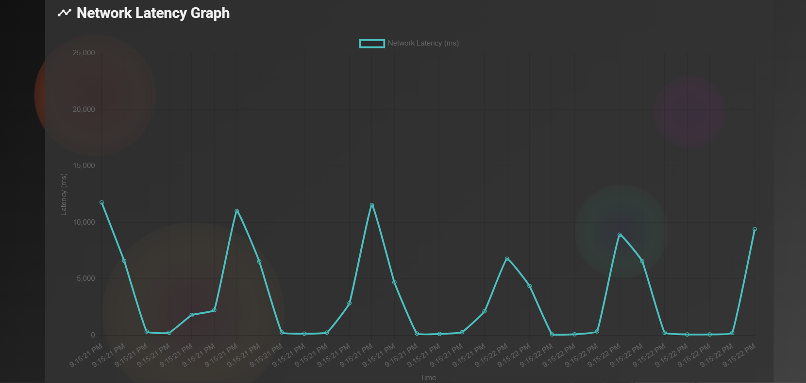
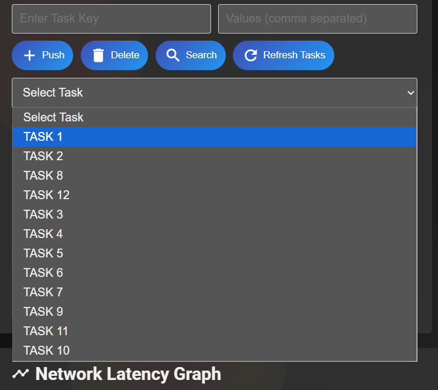
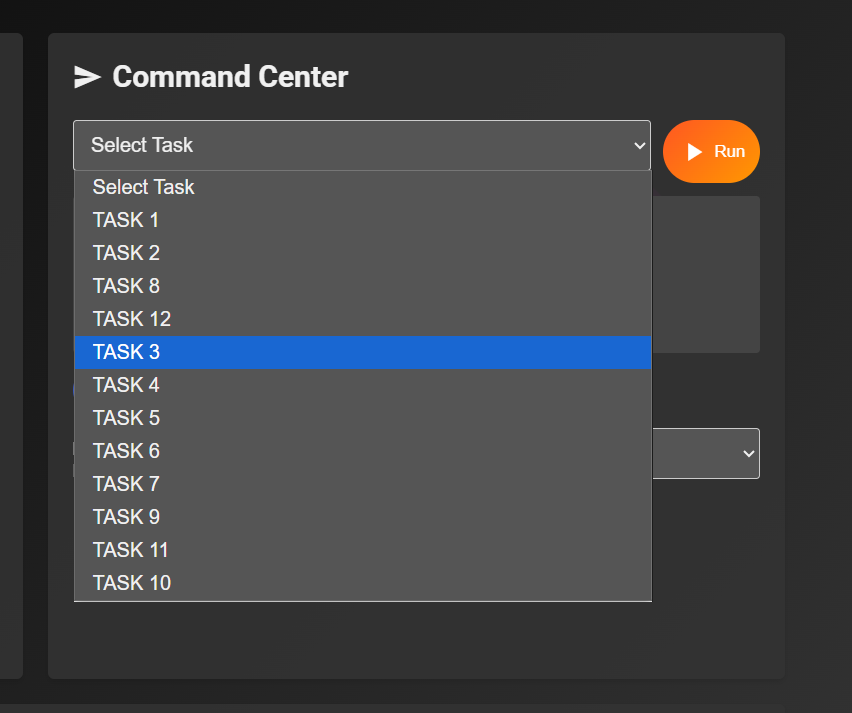
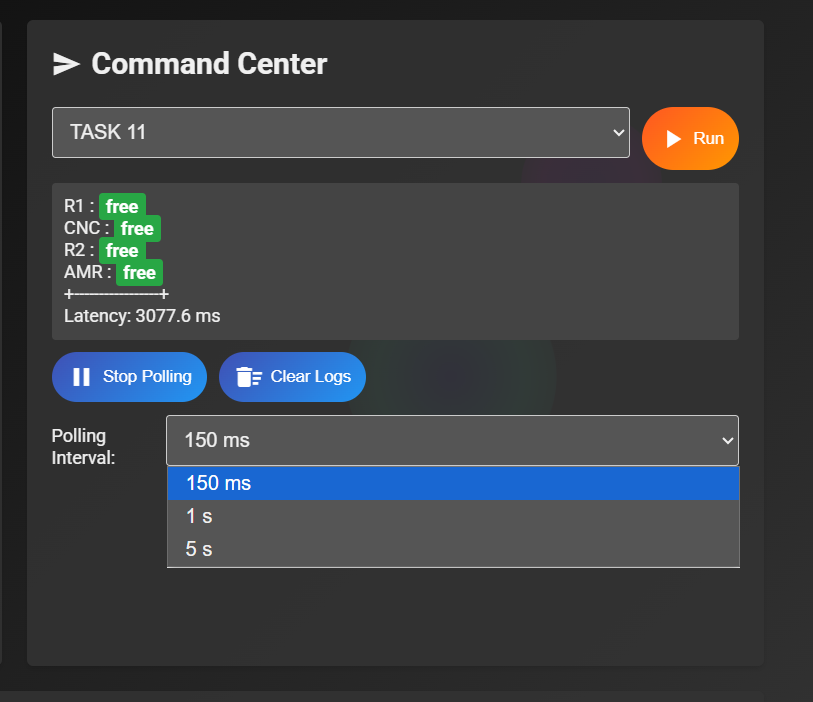

<div align="center">
  
</div>

<br />

<div align="center">
  
  
  
  
</div>

<br />

# Cloud-Enabled Digital Twin

This repository is a professional archive for an early **Cloud-Enabled Digital Twin** prototype. The project acted as a temporary validation layer for cloud-triggered workflows, API orchestration, latency measurement, polling behavior, and command execution testing before the system migrated into a production-oriented Unity implementation.

> **Repository status:** Deprecated. The AWS APIs used by this prototype were removed, so the project is not runnable and should be treated as documentation only.

---

## Snapshot

<table>
  <tr>
    <td width="25%"><br /><strong>Purpose</strong><br />Pre-production validation layer</td>
    <td width="25%"><br /><strong>Interface</strong><br />HTML and JavaScript dashboard</td>
    <td width="25%"><br /><strong>Cloud Layer</strong><br />AWS API orchestration</td>
    <td width="25%"><br /><strong>Successor</strong><br />Unity 6 Phase 1 system</td>
  </tr>
  <tr>
    <td><strong>Communication</strong><br />HTTPS polling during prototype phase</td>
    <td><strong>Metrics</strong><br />Latency and response timing</td>
    <td><strong>Availability</strong><br />Not public and not maintained</td>
    <td><strong>Current Use</strong><br />Technical reference archive</td>
  </tr>
</table>

---

## Technical Scope

<table>
  <tr>
    <th align="left">Layer</th>
    <th align="left">Role</th>
    <th align="left">Status</th>
  </tr>
  <tr>
    <td><strong>Prototype UI</strong></td>
    <td>Temporary dashboard for validation and testing workflows</td>
    <td>Archived</td>
  </tr>
  <tr>
    <td><strong>AWS API Layer</strong></td>
    <td>Remote machine triggers and cloud-to-system orchestration</td>
    <td>Removed</td>
  </tr>
  <tr>
    <td><strong>Polling Layer</strong></td>
    <td>Latency checks, response timing, and early communication validation</td>
    <td>Replaced</td>
  </tr>
  <tr>
    <td><strong>Unity Digital Twin</strong></td>
    <td>Production-level 3D Digital Twin implementation</td>
    <td>Successor system</td>
  </tr>
</table>

---

## Architecture Tree

<div align="center">
  
</div>

---

## System Evolution

```mermaid
flowchart LR
    A["HTML / JavaScript Prototype"] --> B["AWS API Validation"]
    B --> C["Remote Machine Triggering"]
    C --> D["Latency and Polling Tests"]
    D --> E["Multi-layer Integration"]
    E --> F["Unity 6 Digital Twin"]
    F --> G["Phase 1 Production System"]

    style A fill:#eff6ff,stroke:#2563eb,color:#111827
    style B fill:#fff7ed,stroke:#f97316,color:#111827
    style C fill:#f8fafc,stroke:#64748b,color:#111827
    style D fill:#ecfdf5,stroke:#10b981,color:#111827
    style E fill:#f5f3ff,stroke:#8b5cf6,color:#111827
    style F fill:#dcfce7,stroke:#16a34a,color:#111827
    style G fill:#111827,stroke:#111827,color:#ffffff
```



---

## Repository Tree

```text
Cloud-Enabled-Digital-Twin/
|
|-- assets/                  # README images and visual assets
|
|-- layout/
|   |-- command.js           # Command interface behavior
|   `-- dictionary.js        # Dictionary layout behavior
|
|-- logs/                    # Runtime / validation logs
|
|-- public/
|   `-- server.js            # Server-side prototype entry
|
|-- script/
|   `-- app.js               # Main frontend application logic
|
|-- style/
|   |-- app.css              # Main application styling
|   |-- command.css          # Command interface styling
|   `-- dictionary.css       # Dictionary interface styling
|
|-- README.md
|-- index.html                # Prototype UI entry page
`-- structure.pgsql           # Database/schema reference
```

---

## Prototype Evidence

<table>
  <tr>
    <td width="50%">
      <strong>Dashboard UI</strong><br /><br />
      
    </td>
    <td width="50%">
      <strong>Network Latency Graph</strong><br /><br />
      
    </td>
  </tr>
  <tr>
    <td width="50%">
      <strong>Task Creation and Management</strong><br /><br />
      
    </td>
    <td width="50%">
      <strong>Command Execution Testing</strong><br /><br />
      
    </td>
  </tr>
  <tr>
    <td colspan="2">
      <strong>Polling and Latency Testing</strong><br /><br />
      
    </td>
  </tr>
</table>

---

## Successor System

The validation path from this repository was migrated into a production-level **Unity 6 Digital Twin** implementation. The later system uses a different internal architecture and moved away from the HTTPS polling model used during this prototype phase.

<table>
  <tr>
    <td><strong>Engine</strong></td>
    <td>Unity 6</td>
  </tr>
  <tr>
    <td><strong>Communication</strong></td>
    <td>WSS-based model in the later system</td>
  </tr>
  <tr>
    <td><strong>Distribution</strong></td>
    <td>Windows and macOS builds</td>
  </tr>
  <tr>
    <td><strong>Availability</strong></td>
    <td>Private, not open source, and not WebGL-based</td>
  </tr>
</table>

---

## Archive Notice

This repository is retained for documentation, development reference, and architectural history. It should not be deployed, executed, or used as a production Digital Twin implementation.

```text
Runtime available : No
AWS APIs active   : No
Maintenance       : No
Repository role   : Documentation archive
```

---

## Development Context

This prototype was created during early Digital Twin validation work associated with **Accenture** and development collaboration within the **Indian Institute of Technology Madras** environment. It represents only the temporary testing surface, not the full final system.

<sub>Interface icons are based on Google Material Icons, available under the Apache License 2.0.</sub>
